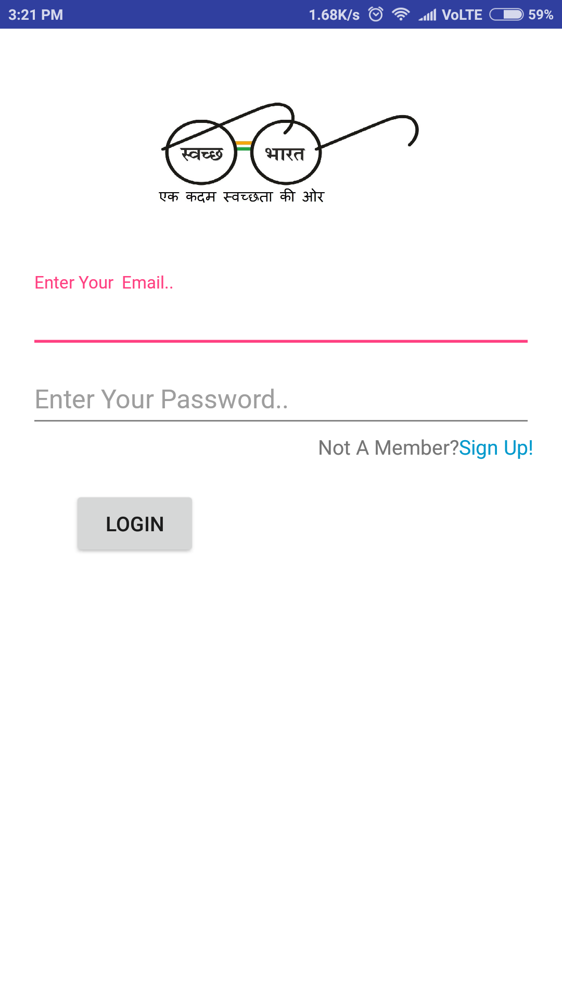
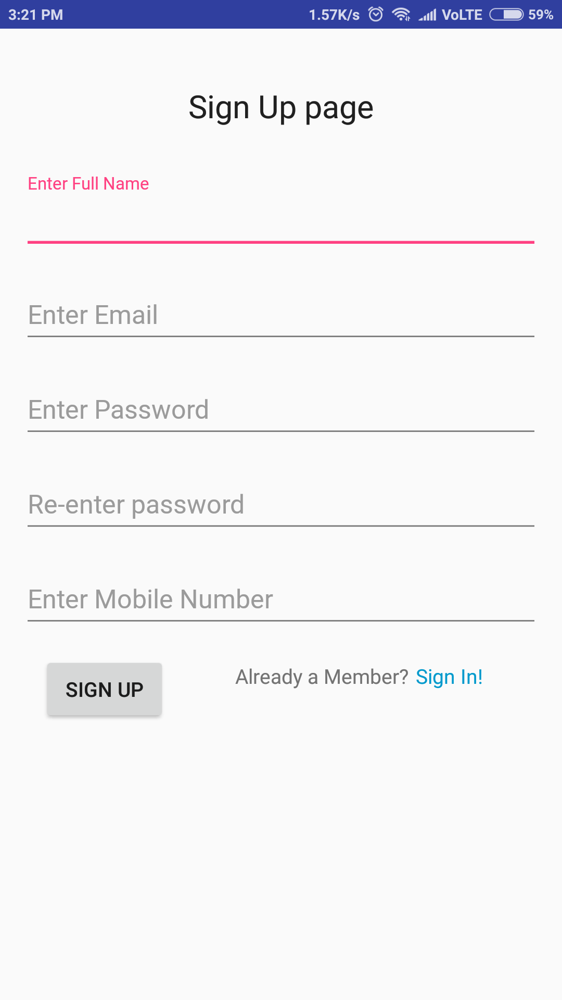
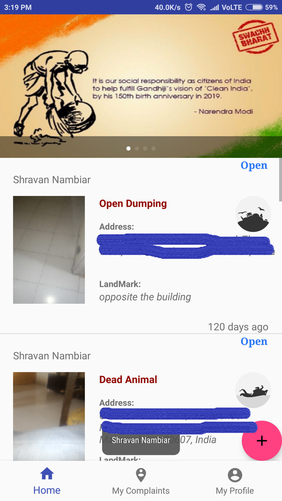
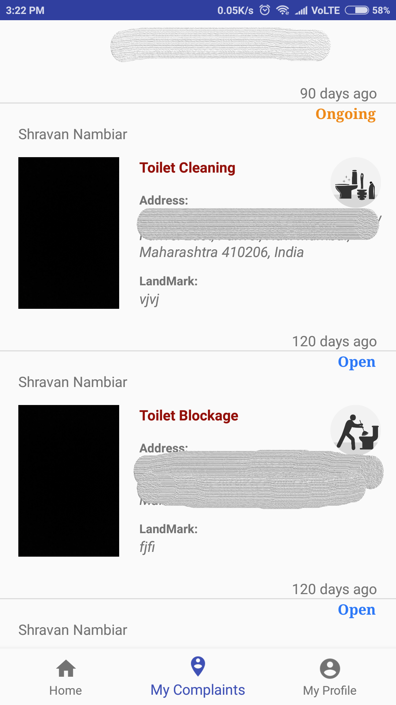
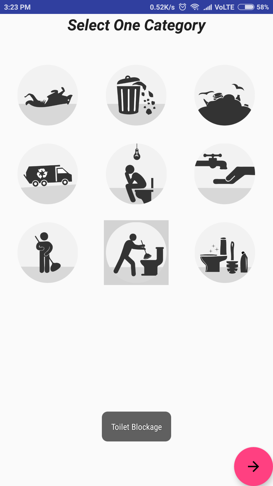
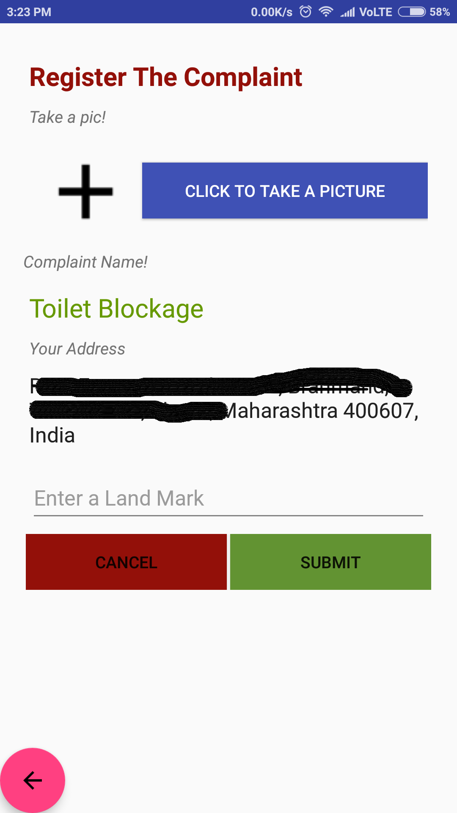
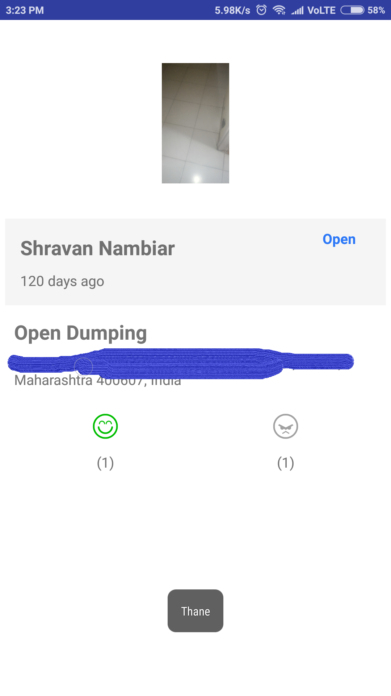

# Swachhta Aabyan
```
This app uses services provided by Firebase such as ,realtime database and authentication.
```
The app enables a citizen to post a civic-related issue (e.g.; a garbage dump) which is then forwarded to the city corporation concerned and thereafter assigned to the sanitary inspector of the particular ward. For the app to work we need to take a picture of the Civic-related issue using your smartphone, and post it in one of the following categories which includes : 1)Garbage vehicle not arrived 2)Sweeping not done 3)Public toilets blockage and cleaning 4) Absence of water supply & electricity in public toilets.5) Dead animals. The app will capture the location while the picture is being taken. Just type in the landmark of the complaint location. The complaint will then be assigned to the concerned sanitary inspector/engineer.
We can also vote up on any other complaint relevant to us and will get regular updates on status of the complaint in the form of a push notification with the ‘Resolved’ image uploaded by the assigned sanitary inspector/engineer.
```
Sadly the Authority side App got corrupted and after many attempts to restore it I failed. So not uploading the app with Authority side.
```

## Features
* Registeration of new users.
* Authentication of registered users.
* Uploading a complaint (uploading an image, complaint category,geo-location and landmark)
* City wise diaplaying of complaints(Eg. if you opened in Mumbai then only Complaints in Mumbai is viewed like vise if opened in Thane then only Complaints in Thane is viewed ).
* Geofencing of complaints(Eg. if a user enters in a range of a registeres complaint then he/she will recieve a notification about that complaint and he/she can give feedback about it).
* Give rating to a complaint which will help the authorities decide the seriousness of the complaint.
* Get list of all complaints registerd by the signed in user
* Get real-time rating of the complaint(Eg. if a complaint has  2 upvotes and 1 downvotes and if  user1 is currently looking at the rating screen and  user2 upvotes it then user1 will be able to see the upvote counter increase without having to refresh anything )

## Pre-requisites
* Android 5.0  or above
* Internet Connection
* Active GPS

## Screen Shots
### Sign in

### Sign Up

### Home Page

### Signed in User complaints

### Upload Process
* Select Category

* Click Picture and Enter Landmark

### Check rating and progress of a complaint



